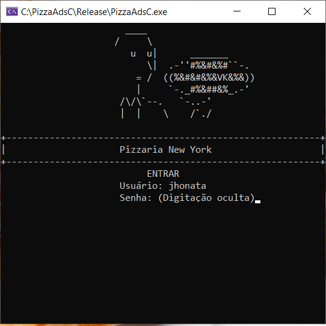
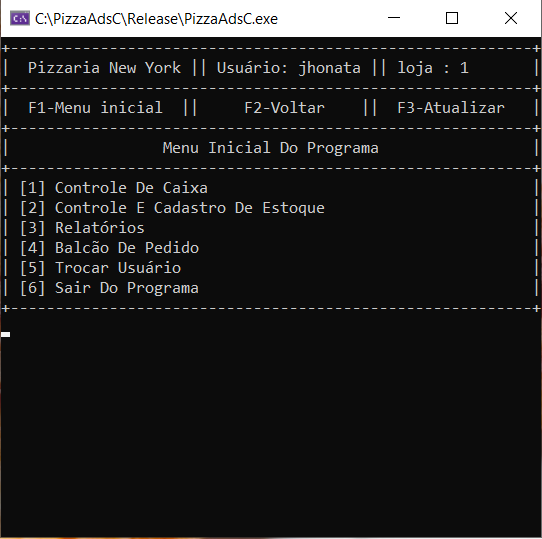

# **App of store management**
 > Management of any simple store in C++.
 
 

# **Usage Example**
 for any store that needed a simple system of cashflow, inventory control system and non-tax impression.
 see below all the functions of the system:
## Functionalities
    [x] Login screen
    [x] All options of cash accounting
    [x] Inventory control
    [x] Cash flow statement
    [x] User permission (operator, manager, owner)
    [x] Shopping cart for products
    [x] non-tax impression
    [x] Dynamic menu (F1, F2, F3)
    [x] All informations are stored in files.TXT

# **Installation**
 Windows Only:
    Download [VisualStudio] (https://visualstudio.microsoft.com/downloads/)
    [Fork this repository] (https://github.com/kissyalone/PimAds)
    modify "loginBDS.txt" 
        > to you own users and passwords.
    Clean all the files from folders 1,2,3 **Except produtoBDS.txt and registroVendas.txt**
    Open produtoBDS.txt and registroVendas.txt and erase everthing inside and save blank.

# **About Me**
 If you need any help contact me:
 [github] (https://github.com/kissyalone)
 [Linkedin] (notfound.com)
 
 > This is a project for my University.
 
 # Thanks you!

